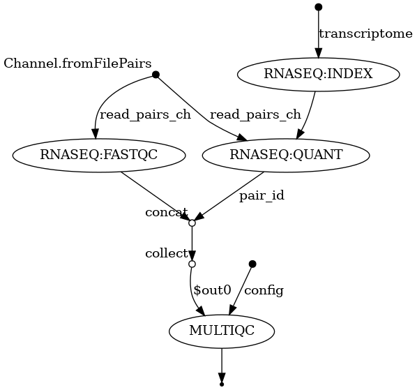

## Table of Contents

- [README](#readme)
  - [TL;DR](#tldr)
  - [Installation](#installation)
  - [Quick demo](#quick-demo)
    - [Run a project from GitHub](#run-a-project-from-github)
  - [Set up for testing purposes only](#set-up-for-testing-purposes-only)
  - [Nextflow tutorial](#nextflow-tutorial)
    - [Processes, channels, and workflows](#processes-channels-and-workflows)
    - [First script](#first-script)
  - [Sarek](#sarek)

# README

[Nextflow](https://www.nextflow.io/) enables scalable and reproducible
scientific workflows using software containers.

## TL;DR

For those coming from WDL (like myself), here's a summary.

A Nextflow workflow is made by joining together different
[processes](https://www.nextflow.io/docs/latest/process.html) (WDL tasks).

```nf
process < name > {

  [ directives ]

  input:
    < process inputs >

  output:
    < process outputs >

  when:
    < condition >

  [script|shell|exec]:
    < user script to be executed >

}
```

The [workflow](https://www.nextflow.io/docs/latest/dsl2.html#workflow) keyword
allows the definition of sub-workflow components that enclose the invocation of
one or more processes and operators.

```nf
workflow my_pipeline {
    take: data
    main:
        foo(data)
        bar(foo.out)
}
```

Processes are executed independently and are isolated from each other; they
communicate with each other through `channels`. Any `process` can define one or
more `channels` as an `input` and `output`.

Output of a process is accessed using the `out` channel, instead of using the
defined output in WDL.

```nf
workflow {
    STRING_TO_FILE(params.string)
    CAT_FILE(STRING_TO_FILE.out)
    CAT_FILE.out.view()
}
```

Pipeline results are also stored in directories with random names (hashes) but
process results are not named by the process name (WDL task outputs are stored
in directories named with `call-task_name`). `STDOUT` and `STDERR` are also
saved but as hidden files in Nextflow.

Use a YAML (JSON in WDL) file to specify parameters. Parameters used with
`nextflow run` are referenced using `params.argv` in the Nextflow script.

```console
nextflow run kallisto.nf -params-file kallisto.yaml --samples <input_file>
```

Nextflow keeps track of all the processes executed in your workflow. If you
modify some parts of your script, only the processes that are changed will be
re-executed. No need to setup call caching like for WDL/Cromwell; just include
a `cache` directive in the process to store the process results to a local
cache and launch the pipeline with `-resume`.

```console
nextflow run hello.nf -resume
```

Sub-workflows are [also supported in
Nextflow](https://carpentries-incubator.github.io/workflows-nextflow/11-subworkflows/index.html);
use `include` (`import` in WDL). Give a (sub-)workflow a name and then you can
include it in another script.

```nf
# sub_wf.nf
workflow SUB_WORKFLOW {
    STRING_TO_FILE(params.string)
    CAT_FILE(STRING_TO_FILE.out)
    CAT_FILE.out.view()
}

# sub_wf_include.nf
include {SUB_WORKFLOW} from './sub_wf.nf'

workflow {
    SUB_WORKFLOW()
}
```

Use `-c my_config` to specify a [config
file](https://www.nextflow.io/docs/latest/config.html) (`-o
cromwell_options.txt` in Cromwell). As I understand from the [Nextflow
configuration](https://training.nextflow.io/basic_training/config/) guide, the
execution settings and workflow parameter settings can be stored into a single
file. Though I think it's better separate the two; use the `-params-file`
option to specify the file with the workflow parameters and `-c` to specify the
file with the workflow execution parameters.

## Installation

On Debian 11 install the Java Runtime Environment and simply download/run the
install script.

```console
sudo apt install default-jre
curl -fsSL get.nextflow.io | bash
```

Otherwise [Conda](https://docs.conda.io/en/latest/) is another way of
installing [Nextflow](https://anaconda.org/bioconda/nextflow). I would
recommend using [Mamba](https://github.com/mamba-org/mamba), which is a faster
version of Conda, to install Nextflow.

```console
mamba create -y \
   -n nextflow \
   -c Bioconda -c conda-forge \
   nextflow

conda activate nextflow

nextflow -version
#
#       N E X T F L O W
#       version 22.10.6 build 5843
#       created 23-01-2023 23:20 UTC (24-01-2023 08:20 JDT)
#       cite doi:10.1038/nbt.3820
#       http://nextflow.io
#

java -version
# openjdk version "17.0.3-internal" 2022-04-19
# OpenJDK Runtime Environment (build 17.0.3-internal+0-adhoc..src)
# OpenJDK 64-Bit Server VM (build 17.0.3-internal+0-adhoc..src, mixed mode, sharing)
```

## Quick demo

Get [training material](https://training.nextflow.io/basic_training/setup/#training-material).

```console
git clone https://github.com/nextflow-io/training.git
```

Run a simple RNA-seq workflow with [metrics and reporting](https://training.nextflow.io/basic_training/rnaseq_pipeline/#metrics-and-reports).

```console
cd training/nf-training/
nextflow run rnaseq-nf -with-docker -with-report -with-trace -with-timeline -with-dag dag.png
```



### Run a project from GitHub

Nextflow allows the execution of a workflow project directly from a
[GitHub](https://training.nextflow.io/basic_training/rnaseq_pipeline/#metrics-and-reports)
repository (or similar services, e.g., BitBucket and GitLab).

This simplifies the sharing and deployment of complex projects and tracking
changes in a consistent manner.

Use `info` to show the project information:

```console
nextflow info nextflow-io/rnaseq-nf
```
```
 project name: nextflow-io/rnaseq-nf
 repository  : https://github.com/nextflow-io/rnaseq-nf
 local path  : /home/dtang/.nextflow/assets/nextflow-io/rnaseq-nf
 main script : main.nf
 description : Proof of concept of a RNA-seq pipeline implemented with Nextflow
 author      : Paolo Di Tommaso
 revisions   : 
 * master (default)
   dev
   dsl2
   enum
   fix-schema
   hybrid
   json-schema-test
   k8s-demo
   programmatic-api
   properties
   sra-demo
   wave
   v1.0 [t]
   v1.1 [t]
   v1.2 [t]
   v2.0 [t]
   v2.1 [t]
   v2.2 [t]
   v2.3 [t]
```

Revision are defined by using Git tags or branches defined in the project
repository. Tags enable precise control of the changes in your project files
and dependencies over time.

Nextflow allows the execution of a specific revision of your project by using
the `-r` command line option.

```console
nextflow run nextflow-io/rnaseq-nf -r v2.3 -with-docker
```

## Set up for testing purposes only

1. Java 11 or later is required (up to 19 is supported);
   `script/install_openjdk.sh` will install OpenJDK 19 into `bin`. Do not
   install version 20 or you will get the following error:

    ERROR: Cannot find Java or it's a wrong version -- please make sure that Java 8 or later (up to 19) is installed

```console
script/install_openjdk.sh

bin/jdk-19.0.2/bin/java -version
# openjdk version "19.0.2" 2023-01-17
# OpenJDK Runtime Environment (build 19.0.2+7-44)
# OpenJDK 64-Bit Server VM (build 19.0.2+7-44, mixed mode, sharing)
```

2. Install Nextflow.

```console
export PATH=$(pwd)/bin/jdk-19.0.2/bin:$PATH
curl -s https://get.nextflow.io | bash
# snipped
#       N E X T F L O W
#       version 23.04.0 build 5857
#       created 01-04-2023 21:09 UTC (02-04-2023 06:09 JDT)
#       cite doi:10.1038/nbt.3820
#       http://nextflow.io
# 
# Nextflow installation completed. Please note:
# - the executable file `nextflow` has been created in the folder: /home/dtang/github/learning_nextflow
# - you may complete the installation by moving it to a directory in your $PATH

mv nextflow bin/jdk-19.0.2/bin/
```

3. Hello world example.

```console
nextflow run hello
# N E X T F L O W  ~  version 23.04.0
# Pulling nextflow-io/hello ...
#  downloaded from https://github.com/nextflow-io/hello.git
# Launching `https://github.com/nextflow-io/hello` [fervent_mendel] DSL2 - revision: 1d71f857bb [master]
# executor >  local (4)
# [ae/272202] process > sayHello (4) [100%] 4 of 4 ✔
# Bonjour world!
# 
# Ciao world!
# 
# Hello world!
# 
# Hola world!
```

## Nextflow tutorial

[Introduction to Bioinformatics workflows with Nextflow and
nf-core](https://carpentries-incubator.github.io/workflows-nextflow/index.html) lesson objectives:

1. The learner will understand the fundamental components of a Nextflow script,
   including channels, processes and operators.
2. The learner will write a multi-step workflow script to align, quantify, and
   perform QC on an RNA-Seq data in Nextflow DSL.
3. The learner will be able to write a Nextflow configuration file to alter the
   computational resources allocated to a process.
4. The learner will use nf-core to run a community curated pipeline, on an
   RNA-Seq dataset.

Nextflow is a workflow management system that combines a runtime environment,
software that is designed to run other software, and a programming domain
specific language (DSL) that eases the writing of computational pipelines.

Nextflow is built around the idea that Linux is the _lingua franca_ of data
science. Nextflow follows Linux's "small pieces loosely joined" philosophy, in
which many simple but powerful command-line and scripting tools, when chained
together, facilitate more complex data manipulations.

Nextflow extends this approach, adding the ability to define complex program
interactions and an accessible (high-level) parallel computational environment
based on the dataflow programming model, whereby `processes` are connected via
their `outputs` and `inputs` to other `processes`, and run as soon as they
receive an input.

The Nextflow scripting language is an extension of the Groovy programming
language, which in turn is a superset of the Java programming language. Groovy
simplifies the writing of code and is more approachable than Java; see Groovy's
[semantics](https://groovy-lang.org/semantics.html).

Nextflow (version > 20.07.1) provides a revised syntax to the original DSL,
known as DSL2. This feature is enabled by the following directive at the
beginning of a workflow script:

    nextflow.enable.dsl=2

### Processes, channels, and workflows

Nextflow workflows have three main parts:

1. Processes - describe a task to be run and can be written in any scripting
	 language that can be executed on Linux (e.g. Bash, Perl, Python, etc.). They
   define inputs and outputs for a task. Processes spawn a task for each complete
   input set and each task is executed independently and cannot interact with
	 another task. The only way data can be passed between process tasks is via
   asynchronous queues, called channels.
2. Channels - channels are used to manipulate the flow of data from one process
   to the next.
3. Workflows - this section is used to explicitly define the interaction
   between processes and the pipeline execution flow.


In the example above we have a `samples` channel containing three input FASTQ
files. The `fastqc` process takes the `samples` channel as input and since the
channel has three elements, three independent instances (tasks) of that process
are run in parallel. Each task generates an output, which is passed to the
`out_ch` channel and is used as input for the `multiqc` process.

While a `process` defines what command or script has to be executed, the
`executor` determines how that script will be run in the target system. The
default is to execute processes on the local computer, which is useful for
pipeline development, testing, and small scale workflows. For large scale
computational pipelines, a High Performance Cluster (HPC) or Cloud platform is
desired.


Nextflow provides a separation between the pipeline's functional logic and the
underlying execution platform. This makes it easy to execute a pipeline on
various platforms without modifying the workflow and is achieved by defining
the target execution platform in a configuration file.

Nextflow provides [native
support](https://www.nextflow.io/docs/latest/executor.html) for major batch
schedulers and cloud platforms including SGE, SLURM, AWS, and Kubernetes.

### First script

The `wc.nf` script counts the number of lines in a FASTQ file.

```console
nextflow run script/wc.nf
# N E X T F L O W  ~  version 23.04.0
# Launching `script/wc.nf` [stoic_easley] DSL2 - revision: 9cef523068
# executor >  local (1)
# [6b/286e0b] process > NUM_LINES (1) [100%] 1 of 1 ✔
# ref1_1.fq.gz 58708
```

## Sarek

[nf-core/sarek](https://nf-co.re/sarek) is a Nextflow workflow for calling
variants on whole genome, exome, or targeted sequencing data. Following the
[Quick Start](https://nf-co.re/sarek#quick-start) guide:

1. [Install using Mamba](#installation).
2. Docker installed.
3. Download and test pipeline:

```console
time nextflow run nf-core/sarek -profile test,docker --outdir sarek_test
# snipped
# -[nf-core/sarek] Pipeline completed successfully-
# Completed at: 14-Apr-2023 09:48:56
# Duration    : 9m 18s
# CPU hours   : 0.1
# Succeeded   : 26
#
# real    9m37.830s
# user    1m51.006s
# sys     0m14.591s
```

4. Run your own analysis

```console
nextflow run nf-core/sarek --input samplesheet.csv --outdir <OUTDIR> --genome GATK.GRCh38 -profile docker
```

See the [usage page](https://nf-co.re/sarek/usage) for more information.
