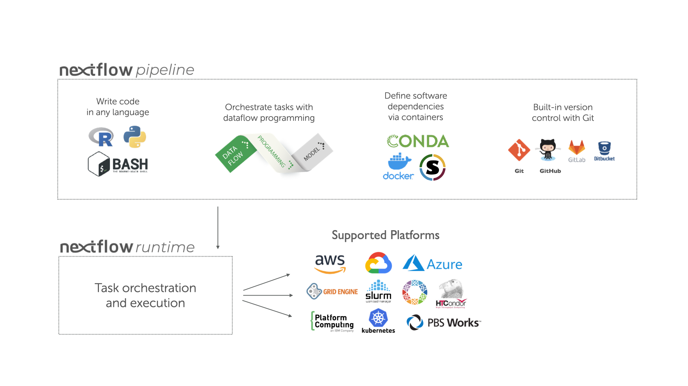

Table of Contents
=================

* [README](#readme)
   * [Learning outcomes](#learning-outcomes)
   * [Environment setup](#environment-setup)
   * [Basic concepts](#basic-concepts)
   * [Hello](#hello)

Created by [gh-md-toc](https://github.com/ekalinin/github-markdown-toc)

# README

Check out the [Nextflow community training
portal](https://training.nextflow.io/) for training material. This directory
contains notes for the [Basic Nextflow Training
Workshop](https://training.nextflow.io/basic_training/).

## Learning outcomes

1. Be proficient in writing Nextflow workflows
2. Know the basic Nextflow concepts of Channels, Processes and Operators
3. Have an understanding of containerised workflows
4. Understand the different execution platforms supported by Nextflow
5. Be introduced to the Nextflow community and ecosystem

## Environment setup

Local setup requires:

1. Bash
2. Java 11 (or later, up to 18)
3. Git
4. Docker

Optional requirements include:

1. Singularity 2.5.x (or later)
2. Conda 4.5 (or later)
3. Graphviz
4. AWS CLI
5. A configured AWS Batch computing environment

Install Nextflow using
[mamba](https://github.com/davetang/learning_nextflow#installation) and confirm
installation.

```console
conda activate nextflow
nextflow info
#   Version: 22.10.6 build 5843
#   Created: 23-01-2023 23:20 UTC (24-01-2023 08:20 JDT)
#   System: Linux 3.10.0-1062.el7.x86_64
#   Runtime: Groovy 3.0.13 on OpenJDK 64-Bit Server VM 17.0.3-internal+0-adhoc..src
#   Encoding: UTF-8 (UTF-8)
```

Download the [training material](https://github.com/nextflow-io/training).

```console
git clone https://github.com/nextflow-io/training.git
```

## Basic concepts

Nextflow is both a workflow orchestration engine and domain-specific language
(DSL) that can be used to create computational workflows. Nextflow can be used
to define program interactions and a high-level parallel computational
environment. Nextflow's core features include:

* Workflow portability and reproducibility
* Scalability of parallelisation and deployment
* Integration of existing tools, systems, and industry standards

A Nextflow workflow is made up by joining together different processes. Each
`process` can be written in any scripting language that can be executed by
Linux.

Processes are executed independently and are isolated from each other. The only
way they can communicate is via asynchronous first-in, first-out (FIFO) queues,
called `channels`.

> [Asynchrony](https://en.wikipedia.org/wiki/Asynchrony_(computer_programming)),
> in computer programming, refers to the occurrence of events independent of the
> main program flow and ways to deal with such events. These may be "outside"
> events such as the arrival of signals, or actions instigated by a program that
> take place concurrently with program execution, without the program blocking to
> wait for results.

Any `process` can define one or more `channels` as an `input` and `output`. The
interaction between these processes is implicitly defined by these `input` and
`output` declarations.

The executor determines how a script is run on a target platform; the default
is to execute processes on the local computer. The local executor is useful for
workflow development and testing purposes but in a production setting, a
high-performance computing (HPC) or cloud platform is often used.



Nextflow implements a declarative DSL that serves as an extension of a
general-purpose programming language. Nextflow scripting is an extension of
Groovy, which is a super-set of Java. Groovy simplifies the writing of code and
is more approachable than Java.

## Hello

The `hello.nf` script takes an input string (a parameter called
`params.greeting`) and splits it into chunks of six characters in the first
process. The second process then converts the characters to upper case.

The use of the operator `.flatten()` in the workflow block is for splitting the
two files into two separate items to be put through the next process (or else
they would be treated as a single element).

```nextflow
#!/usr/bin/env nextflow

params.greeting = 'Hello world!'
greeting_ch = Channel.of(params.greeting)

process SPLITLETTERS {
    input:
    val x

    output:
    path 'chunk_*'

    """
    printf '$x' | split -b 6 - chunk_
    """
}

process CONVERTTOUPPER {
    input:
    path y

    output:
    stdout

    """
    cat $y | tr '[a-z]' '[A-Z]' 
    """
}

workflow {
    letters_ch = SPLITLETTERS(greeting_ch)
    results_ch = CONVERTTOUPPER(letters_ch.flatten())
    results_ch.view{ it }
}
```

Execute the script.

```console
nextflow run training/nf-training/hello.nf
# N E X T F L O W  ~  version 22.10.6
# Launching `training/nf-training/hello.nf` [mighty_mahavira] DSL2 - revision: 197a0e289a
# executor >  local (3)
# [ac/786da9] process > SPLITLETTERS (1)   [100%] 1 of 1 ✔
# [bc/908e8d] process > CONVERTTOUPPER (1) [100%] 2 of 2 ✔
# WORLD!
# HELLO
```

Note that `CONVERTTOUPPER` is executed twice because of `.flatten()`. The
hexadecimal numbers `ac/786da9` and `bc/908e8d` identify the unique process
execution, which is called a `task`; they are also the names of the directories
where each task was executed.

`CONVERTTOUPPER` actually produced two different work directories but only one
is displayed in the log because the log is dynamically refreshed and only the
last directory is shown. Use the following to output all relevant paths to the
screen:

```console
nextflow run training/nf-training/hello.nf -ansi-log false
```

Lastly, `CONVERTTOUPPER` is executed in parallel, so the output can differ
based on which task is executed first.

Nextflow keeps track of all the processes executed in a workflow. If a script
is modified, only the processes that are changed will be re-executed. The
execution of the processes that are not changed will be skipped and the cached
result will be used instead. Include the `-resume` option to enable this
behaviour.

```console
nextflow run training/nf-training/hello.nf -resume
N E X T F L O W  ~  version 22.10.6
Launching `training/nf-training/hello.nf` [astonishing_goldstine] DSL2 - revision: 197a0e289a
[ac/786da9] process > SPLITLETTERS (1)   [100%] 1 of 1, cached: 1 ✔
[bc/908e8d] process > CONVERTTOUPPER (1) [100%] 2 of 2, cached: 2 ✔
WORLD!
HELLO
```

Since nothing was changed, the cached result was used for both processes. The
workflow results are cached by default in `$PWD/work` and can take up a lot of
disk space.

Workflow parameters are declared by prepending the prefix `params` to a
variable name, separated by a period. Their value can be specified on the
command line by prefixing the parameter name with two hyphens. For example:

```console
nextflow run training/nf-training/hello.nf --greeting 'Bonjour le monde!'
# Launching `training/nf-training/hello.nf` [suspicious_meninsky] DSL2 - revision: 197a0e289a
# executor >  local (4)
# [6d/0bfe0a] process > SPLITLETTERS (1)   [100%] 1 of 1 ✔
# [19/300017] process > CONVERTTOUPPER (3) [100%] 3 of 3 ✔
# R LE M
# BONJOU
# ONDE!
```
